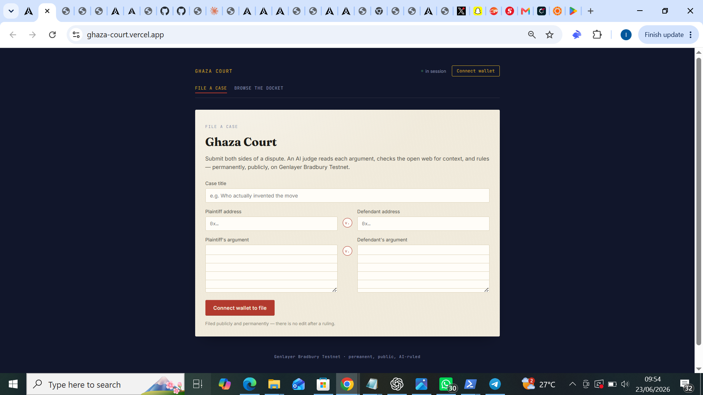

# ⚖️ Ghaza Court

**AI-adjudicated dispute resolution on GenLayer Bradbury Testnet. Two parties. One AI judge. Permanent public ruling.**

🌐 **Live:** [ghaza-court.vercel.app](https://ghaza-court.vercel.app)

---

## What Is Ghaza Court?

Ghaza Court lets any two parties bring a dispute before an AI judge. Both sides submit their arguments. Multiple independent AI validators read both arguments and search for relevant web context, then reach consensus on a ruling — which is sealed permanently on Bradbury chain.

The ruling is public. The ruling is permanent. Nobody can appeal it, edit it, or delete it.

---

## Screenshots


*Submit both sides of a dispute — case title, plaintiff argument, defendant argument*


*The public docket showing 7 filed cases — from "the sky is blue" to "Messi vs Ronaldo"*

---

## How It Works

```
Plaintiff + Defendant each submit their argument
        ↓
Each validator independently fetches Google News RSS for context
        ↓
Each validator analyzes both arguments and reaches a verdict
        ↓
prompt_non_comparative reaches consensus on Bradbury (~3-5 min)
        ↓
Ruling sealed permanently on-chain with full reasoning
```

---

## Ruling Structure

Every case produces a four-field ruling:

| Field | Values |
|---|---|
| `verdict` | `plaintiff` / `defendant` / `split` |
| `confidence` | `high` / `medium` / `low` |
| `reasoning` | Full AI reasoning explaining the ruling |
| `ruling_summary` | One-sentence plain-language verdict |

---

## Features

- **Two-sided submission** — plaintiff and defendant each make their case
- **Web-augmented judgment** — validators fetch real-world context before ruling
- **Public docket** — all rulings browseable by case number
- **Permanent record** — rulings cannot be edited or deleted after consensus
- **Courtroom UI** — serif typography and parchment tones that match the gravity of a public ruling

---

## Live Cases on the Docket

The docket currently has 7 public rulings including:

- *"MESSI HAS WON MORE CHAMPIONS LEAGUE TROPHIES THAN RONALDO"*
- *"Tinubu is the president of Nigeria"*
- *"France won the world cup in 2018"*
- *"the sky is blue"*

All verifiable on-chain.

---

## Tech Stack

| Layer | Technology |
|---|---|
| Smart contract | Python Intelligent Contract (GenLayer) |
| Equivalence principle | `prompt_non_comparative` |
| Web context | Google News RSS |
| Frontend | Vue 3 + TypeScript |
| Blockchain SDK | genlayer-js v1.1.8 |
| Network | GenLayer Bradbury Testnet (Chain ID: 4221) |

---

## Contract Details

- **Address:** `0x2d69396950a863376388B4EF9Bede9D3Ad3411a9`
- **Network:** GenLayer Bradbury Testnet
- **Explorer:** [View on GenExplorer](https://explorer-bradbury.genlayer.com/address/0x2d69396950a863376388B4EF9Bede9D3Ad3411a9)

---

## Key Technical Decisions

**Sequential reads instead of `Promise.all`**
Early versions used `Promise.all` to fetch multiple contract reads simultaneously. On Bradbury's RPC, this caused rate limit errors. Replacing with sequential `for` loops resolved all RPC errors cleanly.

**`prompt_non_comparative` on the verdict field only**
The contract validates only the structured `verdict` field — not the free-text `reasoning`. This keeps consensus tractable: validators agree on the outcome (plaintiff/defendant/split), not the exact wording of the reasoning.

**Google News RSS for factual grounding**
For factual disputes, LLM training data has a cutoff. Google News RSS fetches current, verifiable information that grounds the ruling in real-world facts rather than potentially outdated training data.

---

## Local Development

```bash
git clone https://github.com/terencetttt/Ghaza-Court.git
cd Ghaza-Court/app
npm install
```

Create `.env`:
```
VITE_CONTRACT_ADDRESS=0x2d69396950a863376388B4EF9Bede9D3Ad3411a9
```

```bash
npm run dev
```

---

## Built By

[@terencetttt](https://github.com/terencetttt) — building on GenLayer Bradbury as part of the GenLayer Developer Program.

Part of a series: [GenZa](https://github.com/terencetttt/GenZa) · **Ghaza Court** · [ChainSolve](https://github.com/terencetttt/ChainSolve)
